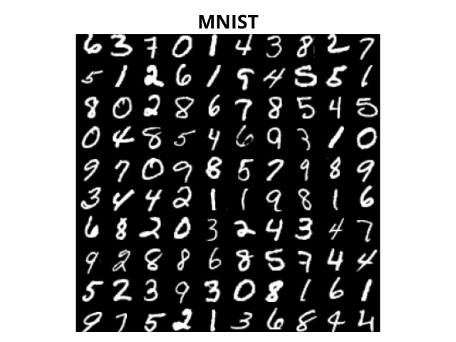
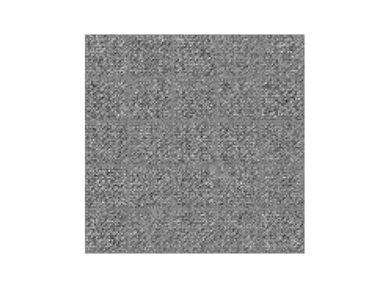
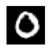

# <h1 align="center">**Conditional GAN**</h1>

 

This repository focuses on implementing [Conditional Generative Adversarial Networks (GANs)](https://arxiv.org/abs/1411.1784) for generating images based on specific labels. Conditional GANs enable controlled image generation by conditioning the output of the generator on a specific label or class, providing the ability to select what type of image to generate.

## **Dataset Configuration**
The dataset used is MNIST, which consists of a training set of 60,000 handwritten digit images (from 0 to 9), and an additional test set of 10,000 samples. Accessing this dataset is straightforward through libraries such as TensorFlow Datasets and PyTorch Datasets.

## **Implementations in TensorFlow and PyTorch**
Implementations have been done in both TensorFlow and PyTorch, the two most widely used frameworks in Deep Learning, to explore the capabilities of conditional GANs. Each implementation provides insights into the differences and similarities between these frameworks, offering practical perspectives for professionals in the field.

- [TensorFlow Notebook](CondicionalGAN_MNIST_TensorFlow.ipynb)

- [PyTorch Notebook](CondicionalGAN_MNIST_PyTorch.ipynb)

## **Key Aspects of Conditional GANs**
- In conditional GANs, the input vector for the generator must contain both the noise vector and the target class information, both concatenated. This differs from a traditional GAN where only the noise vector is used as input for the generator. The class is represented by a one-hot encoded vector, where the length of the vector is equal to the number of classes, and each index represents a specific class, with a value of 1 in the chosen class and 0 in the others.
  
- Class vector interpolation is employed, allowing for the generation of intermediate images between two specific classes. This process gradually transforms an image from one class to another, providing control over the transition between classes using a conditional GAN. Additionally, noise vector interpolation is applied, keeping the class constant while varying the noise vector to generate images of the same class at different interpolation steps.

- The architectures of the generator and discriminator are based on [DCGAN](https://arxiv.org/pdf/1511.06434.pdf), a direct extension of GAN that utilizes convolutional and transposed convolutional layers.

## **Generated Examples**

 

*The quality of digit generation improves as epochs progress, and it can also be observed that the generator correctly predicts the respective classes, using the specific noise vector ``[0, 0, 9, 3, 5, 4, 0, 3, 4, 2, 5, 3, 1, 7, 8, 1, 9, 7, 4, 6, 9, 6, 0, 1, 9]`` in this particular example.*

## **Interpolation example**

 

*Through class vector interpolation, the transition from the first class (digit 0) to the last class (digit 9) can be observed.*

## Technological Stack
 

## Contact

